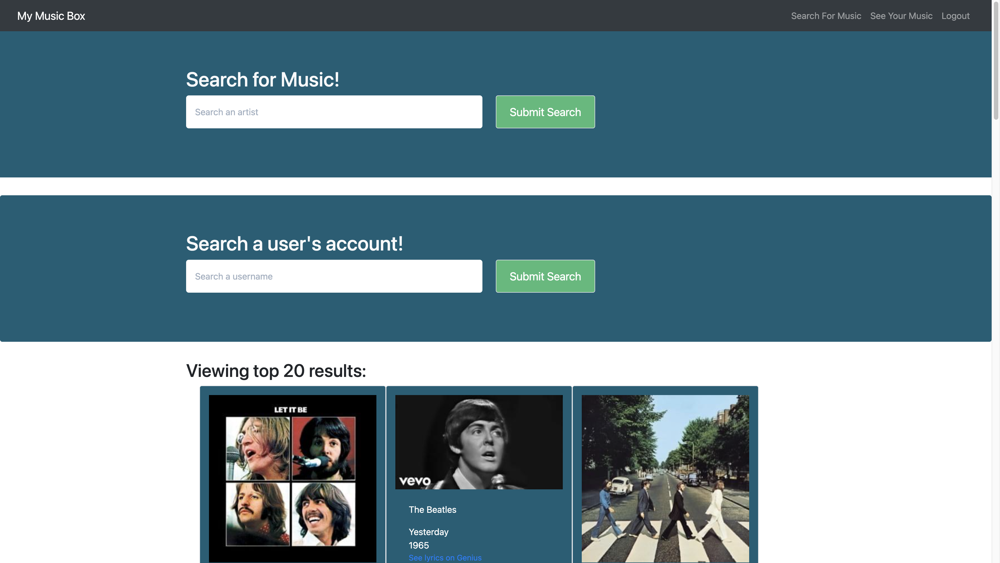
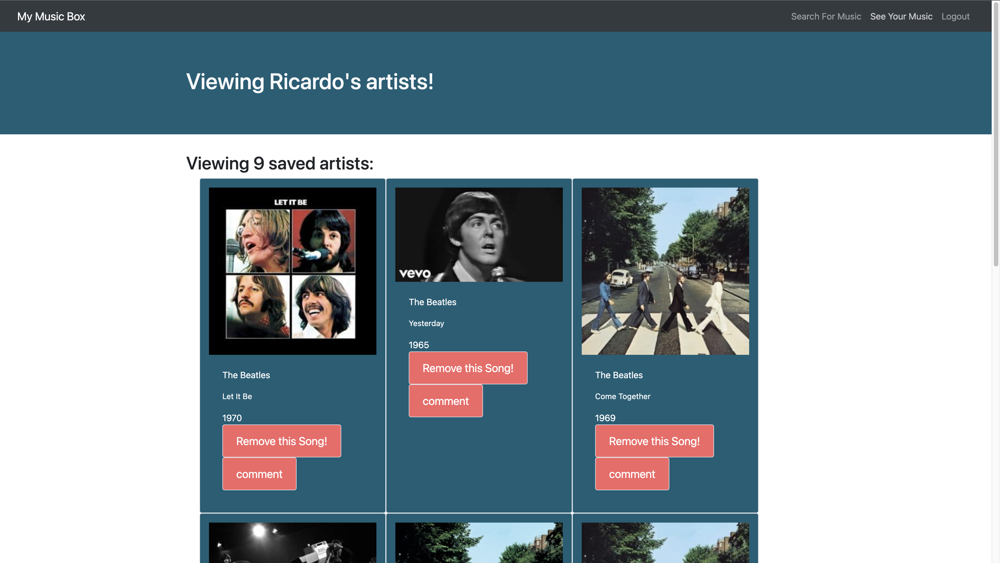

# My Music Box

  

  ## Screenshots
  
  

  ## Description
  This app utilizes the Genius API to search songs that a user can like and add to their liked music page.

  ## Deployed Link
  Heroku link: https://my-music-box-app.herokuapp.com/

  ## Table of Content
   - [Project Description](#description)
   - [Deployed Link](#deployed-link)
   - [Installation](#installation)
   - [Usage](#usage)
   - [License](#license)
   - [Questions](#questions)
  
  
  ## Installation
  Run 'npm install'

  ## Usage
  Install the npm packages then run "npm run develop"

  ## License
  This project is under the ISC license.

  ## Questions

  If you have questions about this project contact Zac Fisher at zcfshr@gmail.com my GitHub is at https://github.com/zacfisher1990
